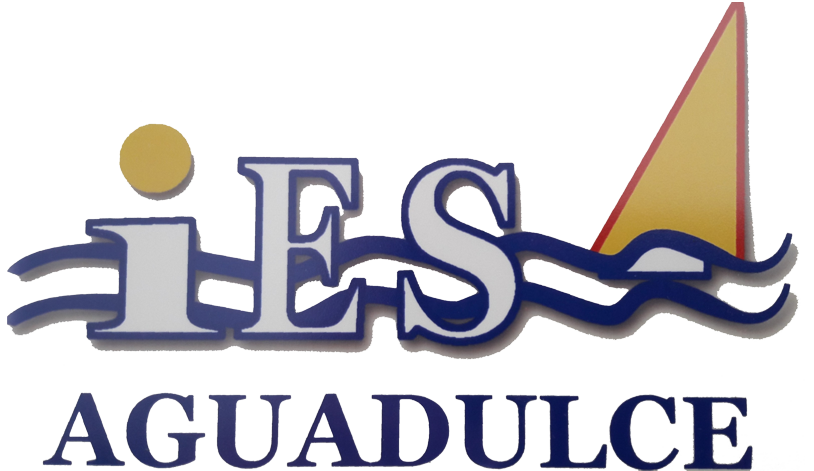

# Tarea 1: Git

### _David Mero Zambrano_ [@DavidMero](https://github.com/usuarioGithub)

> LMSGI - Lenguaje de Marcas y Sistemas de Gestión de la Información. DAW.
> 
> Año escolar: 2024-25
> 
> 

## Documentación.

Documentación de la tarea 1

[Publicación](https://24-25-lmsgi.github.io/LM-plantilla-tarea/)

